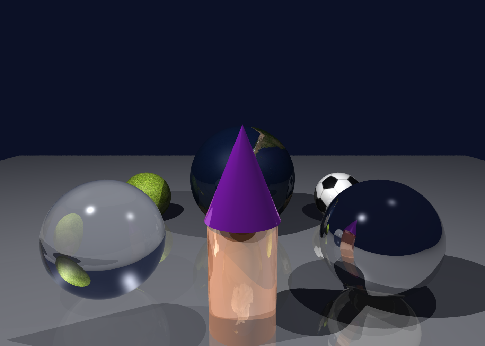

# Blinn-Phong Raytracer

A CPU raytracer written in C++20 with multithreaded tile rendering via POSIX threads.

## Features

- **Geometry**: spheres, cylinders, cones, triangles
- **Shading**: Blinn-Phong with ambient, diffuse, and specular terms
- **Lighting**: point lights and directional lights, soft shadows via transparency
- **Optics**: reflection, refraction, Fresnel blending
- **Textures**: PPM texture mapping on all geometry types
- **Multithreading**: image split into 16×16 tiles dispatched across all available CPU cores via `pthread`

## Build

```
make
```

Requires g++ with C++20 support and pthreads (standard on Linux/macOS).

## Usage

```
./raytracer <scene.txt>
```

Outputs a PPM image at the path specified in the scene file. Open with GIMP or any PPM viewer.

## Scene File Format

Each line starts with a keyword followed by parameters.

| Keyword | Parameters | Description |
|---|---|---|
| `imsize` | `W H` | Output image resolution |
| `eye` | `x y z` | Camera position |
| `viewdir` | `x y z` | Camera direction (unit vector) |
| `updir` | `x y z` | Up direction |
| `vfov` | `degrees` | Vertical field of view |
| `bkgcolor` | `r g b eta` | Background color and index of refraction |
| `light` | `x y z w intensity` | Light source (`w=1` point, `w=0` directional) |
| `mtlcolor` | `dr dg db sr sg sb ka kd ks shininess alpha eta` | Material definition |
| `texture` | `file.ppm` | Texture to apply to the next object |
| `sphere` | `cx cy cz radius` | Sphere |
| `cylinder` | `cx cy cz dx dy dz radius length` | Cylinder |
| `cone` | `cx cy cz dx dy dz angle height` | Cone |
| `v` | `x y z` | Vertex position (for triangles) |
| `vn` | `x y z` | Vertex normal |
| `vt` | `u v` | Vertex texture coordinate |
| `f` | `v0/t0/n0 v1/t1/n1 v2/t2/n2` | Triangle face |

`mtlcolor` and `texture` apply to all objects defined after them until the next `mtlcolor`/`texture`.

### Example

```
imsize 1400 1000
eye 0 0 -8
viewdir 0 0 1
updir 0 1 0
vfov 45
bkgcolor 0.2 0.2 0.2 1.0

light 0.5 1 -0.3 0 0.9

mtlcolor 0 1 0 0.3 0.2 0.3 0.1 0.7 0.2 50 1 1
sphere 0 0 14 2
```

## Demo




